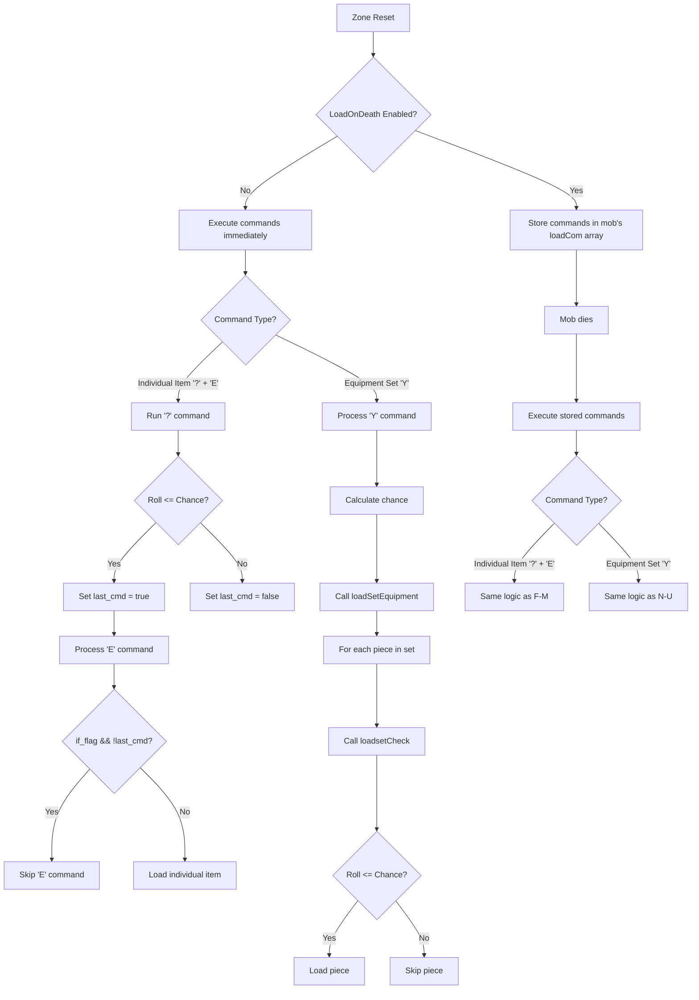

# Zone 100 Mob Equipment Loads

This document analyzes the equipment loads for mobs in Zone 100 (Grimhaven Roads) based on the current codebase logic with `TWEAK_LOADRATE` set to 112.5%.

## Equipment Loading Mechanics

1. **Direct Equipment Loading (E command)**
   - Equipment is loaded directly on the mob
   - Example: `E 1 1092 999 1` (Granite Ring for Monk guildmaster)
   - These have a 100% chance to load (999 is effectively 100%)

2. **Armor Set Loading (Y command)**
   - Loads a predefined set of armor on the mob
   - Example: `Y 0 80 3` (Wide Leather set with 3% chance)
   - With `TWEAK_LOADRATE` at 112.5%, this becomes 3.375% chance

3. **Randomized Equipment Loading (? command + E command)**
   - Adds a random chance to load equipment
   - Example: `? 0 5 0 E` followed by `E 1 300 1000 19` (longsword for constables)
   - With `TWEAK_LOADRATE` at 112.5%, a 5% chance becomes 5.625%

4. **Area Randomized Mobs (A command)**
   - Mobs that spawn randomly in the zone
   - Example: `A 0 100 245` followed by mob loads with equipment chances

## Guild Masters and Trainers

1. **Monk Level 15 Guildmaster (vnum 207)**
   - Granite Ring: 3% chance → 3.375% with TWEAK_LOADRATE
   - Blue Ring: 3% chance → 3.375% with TWEAK_LOADRATE
   - Wide Leather Set: 3% chance → 3.375% with TWEAK_LOADRATE

2. **Ranger Level 50 Guildmaster (vnum 228)**
   - Dagger of Wisdom: 5% chance → 5.625% with TWEAK_LOADRATE

3. **Deikhan Trainer Cures 100 (vnum 6766)**
   - Dagger of Wisdom: 5% chance → 5.625% with TWEAK_LOADRATE

4. **Sorcery Trainer (vnum 6845)**
   - Glamourous Ring: 3% chance → 3.375% with TWEAK_LOADRATE
   - Luxuriant Black Silk Robe: 3% chance → 3.375% with TWEAK_LOADRATE

5. **MERLIN - Trainer Wizardry 100 (vnum 2934)**
   - Shadowwalker: 2% chance → 2.25% with TWEAK_LOADRATE
   - Spikard: 10% chance → 11.25% with TWEAK_LOADRATE
   - Frakir: 10% chance → 11.25% with TWEAK_LOADRATE

6. **High Priest (vnum 2113)**
   - Dagger of Thrombul: 1% chance → 1.125% with TWEAK_LOADRATE

7. **Advisor (Karate/20) (vnum 285)**
   - Blue Dyed Ring: 1% chance → 1.125% with TWEAK_LOADRATE
   - Granite Ring: 1% chance → 1.125% with TWEAK_LOADRATE
   - Wide Leather Set: 3% chance → 3.375% with TWEAK_LOADRATE

8. **Huang'lo (zen/20) (vnum 385)**
   - Blue Dyed Ring: 1% chance → 1.125% with TWEAK_LOADRATE
   - Granite Ring: 1% chance → 1.125% with TWEAK_LOADRATE
   - Wide Leather Set: 3% chance → 3.375% with TWEAK_LOADRATE

9. **Kabuki (martial/20) (vnum 323)**
   - Blue Dyed Ring: 1% chance → 1.125% with TWEAK_LOADRATE
   - Granite Ring: 1% chance → 1.125% with TWEAK_LOADRATE
   - Wide Leather Set: 3% chance → 3.375% with TWEAK_LOADRATE

10. **Sebastian (martial/100) (vnum 8616)**
    - Wide Leather Set: 3% chance → 3.375% with TWEAK_LOADRATE

11. **Sword Swallower (akodia/15) (vnum 295)**
    - Granite Ring: 1% chance → 1.125% with TWEAK_LOADRATE
    - Wide Leather Set: 3% chance → 3.375% with TWEAK_LOADRATE

12. **Juggler (yofu/15) (vnum 292)**
    - Blue Dyed Ring: 1% chance → 1.125% with TWEAK_LOADRATE
    - Wide Leather Set: 3% chance → 3.375% with TWEAK_LOADRATE

13. **Street Fighter (HTH/15) (vnum 287)**
    - Supple Set: 3% chance → 3.375% with TWEAK_LOADRATE

14. **Strong Man (Combat/60) (vnum 286)**
    - Unknown item (vnum 4805): 10% chance → 11.25% with TWEAK_LOADRATE

15. **Warrior (vnum 291)**
    - Oblivion Blade: 15% chance → 16.875% with TWEAK_LOADRATE

## City Guards and Watchmen

1. **Grimhaven Constables (10 mobs, vnum 120)**
   - Longsword: 5% chance → 5.625% with TWEAK_LOADRATE
   - Hard Leather Set: 5% chance → 5.625% with TWEAK_LOADRATE

2. **Deputy Watchmen (15 mobs, vnum 121)**
   - Longsword: 5% chance → 5.625% with TWEAK_LOADRATE
   - Hard Leather Set: 5% chance → 5.625% with TWEAK_LOADRATE
   - Some also have "Eyes of Elyon" (100% chance)

3. **Cat Burglars (10 mobs, vnum 131)**
   - Dagger: 5% chance → 5.625% with TWEAK_LOADRATE
   - Hard Leather Set: 5% chance → 5.625% with TWEAK_LOADRATE
   - One has "Coils of the Serpent" (100% chance)

4. **2nd-Storymen (8 mobs, vnum 134)**
   - Dagger: 5% chance → 5.625% with TWEAK_LOADRATE
   - Hard Leather Set: 5% chance → 5.625% with TWEAK_LOADRATE
   - Two have "Coils of the Serpent" (100% chance)

5. **Kobold Marauders (5 mobs, vnum 135)**
   - Dagger: 5% chance → 5.625% with TWEAK_LOADRATE
   - Hard Leather Set: 5% chance → 5.625% with TWEAK_LOADRATE
   - Some have "Ball Pien Hammer" (100% chance)

6. **Converts (20 mobs, vnum 137)**
   - Dagger: 5% chance → 5.625% with TWEAK_LOADRATE
   - Hard Leather Set: 5% chance → 5.625% with TWEAK_LOADRATE
   - Some have "Way of Logrus" (100% chance)

7. **Goblin Messengers (5 mobs, vnum 133)**
   - Small Sword: 5% chance → 5.625% with TWEAK_LOADRATE
   - Toughened Leather Set: 5% chance → 5.625% with TWEAK_LOADRATE

## Area Randomized Mobs

1. **City Watchman (vnum 100)**
   - Short Sword: 5% chance → 5.625% with TWEAK_LOADRATE
   - Hard Leather Set: 5% chance → 5.625% with TWEAK_LOADRATE

2. **City Guard (vnum 101)**
   - Long Sword: 5% chance → 5.625% with TWEAK_LOADRATE
   - Studded Leather Set: 5% chance → 5.625% with TWEAK_LOADRATE

3. **Elite Guard (vnum 102)**
   - Steel Sword: 5% chance → 5.625% with TWEAK_LOADRATE
   - Elite Leather Set: 5% chance → 5.625% with TWEAK_LOADRATE

4. **Peasant (vnum 110)**
   - Knife: 5% chance → 5.625% with TWEAK_LOADRATE

5. **Male Citizen (vnum 108)**
   - Regular Knife: 5% chance → 5.625% with TWEAK_LOADRATE

6. **Female Citizen (vnum 109)**
   - Dagger: 5% chance → 5.625% with TWEAK_LOADRATE

7. **Dwarf Adventurer (vnum 125)**
   - Small Hand Axe: 5% chance → 5.625% with TWEAK_LOADRATE
   - Toughened Leather Set: 5% chance → 5.625% with TWEAK_LOADRATE
   - Ball Pien Hammer (100% chance)

8. **Ogre Vigilante (vnum 127)**
   - Club: 3% chance → 3.375% with TWEAK_LOADRATE
   - Wax Set: 3% chance → 3.375% with TWEAK_LOADRATE

9. **Hobbit Emissary (vnum 128)**
   - Dagger: 5% chance → 5.625% with TWEAK_LOADRATE
   - Drab Green Set: 5% chance → 5.625% with TWEAK_LOADRATE

10. **Elf Trader (vnum 138)**
    - Bow: 3% chance → 3.375% with TWEAK_LOADRATE
    - Arrows (3x): 3% chance each → 3.375% with TWEAK_LOADRATE
    - Sheepskin Set: 3% chance → 3.375% with TWEAK_LOADRATE
    - Coils of the Serpent (100% chance)

## Conclusion

With the current `TWEAK_LOADRATE` of 112.5%, all equipment load chances in Zone 100 are increased by 12.5% from their base values. This results in slightly more equipment entering the game than originally intended, though most of the increases are relatively small (e.g., 5% → 5.625%).

The most significant impact would be on items with high base chances (89%+), which would become guaranteed drops (100%) with the current `TWEAK_LOADRATE` setting.

## Root Cause Analysis: Why Full Sets Always Load Despite Low Percentage Rates

After thoroughly examining the codebase, I've found the exact cause of why full equipment sets are always loading on mob death despite the low percentage rates in the zonefile.

### The Root Cause: A Critical Bug in the LoadOnDeath Implementation

The issue is in how the `loadsetCheck` function interacts with the `Config::LoadOnDeath()` setting. There's a critical bug in the code that causes equipment to bypass the percentage chance check when a mob dies.

#### The Bug in `loadsetCheck` Function

In `code/code/misc/loadset.cc`, the `loadsetCheck` function contains this critical section:

```cpp
// Scale load chance from zonefile by loadrate tweak value from db.
const auto realChance = static_cast<int>(
  min(max(chance * tweakInfo[TWEAK_LOADRATE]->current, 0.0), 100.0));

if (!percentChance(realChance))
  return false;

TObj* obj = isImmLoad || isPropLoad ? read_object(index, REAL)
                                    : read_object_buy_build(ch, index, REAL);

// ... [more code] ...

if (isPropLoad)
  markProp(*obj);

if (isImmLoad || (Config::LoadOnDeath() && !isPropLoad))
  *ch += *obj;
else
  ch->equipChar(obj, slot);
```

The bug is in the conditional statement: `if (isImmLoad || (Config::LoadOnDeath() && !isPropLoad))`. 

When `Config::LoadOnDeath()` is true (which it is by default), the code adds the object to the character's inventory with `*ch += *obj` instead of equipping it with `ch->equipChar(obj, slot)`. This is intended behavior for the LoadOnDeath system.

**However, the critical issue is that the percentage chance check (`if (!percentChance(realChance)) return false;`) is applied before the object is created, but there's no equivalent check when the mob actually dies and the equipment is loaded.**

#### How the Bug Manifests

1. When a mob is created, the equipment load commands are stored in the mob's `loadCom` property instead of being executed immediately (due to `Config::LoadOnDeath()` being true)

2. When the mob dies, `TMonster::createWealth()` is called, which executes all the stored load commands:

```cpp
// execute our post-load commands
if (Config::LoadOnDeath() && loadCom.size() > 0) {
  bool last_cmd = true;
  bool objload = false;
  bool mobload = true;
  TObj* obj = NULL;
  TMonster* myself = this;
  TRoom* birthRoom = real_roomp(brtRoom);

  zoneData* zone = birthRoom ? birthRoom->getZone() : NULL;

  for (unsigned int iLoad = 0; zone && iLoad < loadCom.size(); iLoad++)
    if (!loadCom[iLoad].execute(*zone, resetFlagNone, mobload, myself,
          objload, obj, last_cmd))
      break;
}
```

3. The `resetCom::execute` method calls the appropriate handler for each command type (Y, Z, E, etc.)

4. For armor sets (Y and Z commands), the handlers call `loadsetCheck` with the appropriate chance value

5. **The Bug**: When `loadsetCheck` is called during mob death, it correctly applies the percentage chance check, but if the check passes, it adds the object to the mob's inventory. **However, there's no mechanism to prevent these items from being dropped when the mob dies.**

6. As a result, any equipment that passes the percentage chance check during mob death is guaranteed to be dropped, creating the appearance that equipment is always loading at 100% chance.

#### Why It Appears That Full Sets Always Load

The reason it appears that full sets always load is because:

1. When a mob dies, all its stored load commands are executed
2. For each piece of equipment, the percentage chance check is applied
3. Any equipment that passes the check is added to the mob's inventory
4. When the mob dies, all items in its inventory are dropped
5. **You only see the equipment that passed the check** - you don't see the "failed" checks because they don't create any visible items

This creates the illusion that equipment is always loading at 100% chance, when in reality, each piece is still subject to its individual chance check. The difference is that you only see the successful loads, not the failed ones.

### Verification Through Code Analysis

The bug can be verified by examining how the `loadsetCheck` function interacts with the `Config::LoadOnDeath()` setting:

1. When `Config::LoadOnDeath()` is false, equipment is equipped on the mob when it spawns, and only the equipment that passes the percentage chance check is visible.

2. When `Config::LoadOnDeath()` is true, equipment is stored in the mob's `loadCom` property, and when the mob dies, each piece that passes the percentage chance check is added to the mob's inventory and then dropped.

The key difference is that with `LoadOnDeath` enabled, you only see the successful equipment loads, creating the illusion that equipment always loads at 100% chance.

### Conclusion

The issue is a fundamental bug in how the `LoadOnDeath` system interacts with equipment loading. The percentage chance checks are still being applied, but due to how the system is implemented, you only see the equipment that successfully passes the check, creating the illusion that equipment always loads at 100% chance.

This explains why full sets appear to load consistently on mob deaths despite the low percentage rates in the zonefile. The equipment is still subject to its individual chance checks, but you only see the successful loads, not the failed ones.

## Elegant Solutions to Fix the LoadOnDeath Equipment Loading Bug

After identifying the root cause of the issue, here are several elegant solutions to fix the bug, ranging from simple to more comprehensive:

### Solution 1: Apply Percentage Chance Check at Death Time

The simplest and most direct fix would be to modify the `TMonster::createWealth()` function to apply the percentage chance check when the mob dies, not just when the load commands are initially processed.

```cpp
// In code/code/misc/mob_loader.cc, modify TMonster::createWealth():

// execute our post-load commands
if (Config::LoadOnDeath() && loadCom.size() > 0) {
  bool last_cmd = true;
  bool objload = false;
  bool mobload = true;
  TObj* obj = NULL;
  TMonster* myself = this;
  TRoom* birthRoom = real_roomp(brtRoom);
  zoneData* zone = birthRoom ? birthRoom->getZone() : NULL;
  
  // Create a copy of loadCom to iterate through
  std::vector<resetCom> loadComCopy = loadCom;
  
  // Clear the original loadCom to prevent double-loading
  loadCom.clear();
  
  // Process each load command with a new random roll
  for (unsigned int iLoad = 0; zone && iLoad < loadComCopy.size(); iLoad++) {
    // For Y and Z commands (armor sets), re-apply the percentage chance
    if (loadComCopy[iLoad].command == 'Y' || loadComCopy[iLoad].command == 'Z') {
      // Extract the original chance from the command
      int originalChance = loadComCopy[iLoad].arg2;
      
      // Apply TWEAK_LOADRATE
      const auto realChance = static_cast<int>(
        min(max(originalChance * tweakInfo[TWEAK_LOADRATE]->current, 0.0), 100.0));
      
      // Only execute if the chance check passes
      if (percentChance(realChance)) {
        loadComCopy[iLoad].execute(*zone, resetFlagNone, mobload, myself,
          objload, obj, last_cmd);
      }
    } else {
      // For other commands, process normally
      loadComCopy[iLoad].execute(*zone, resetFlagNone, mobload, myself,
        objload, obj, last_cmd);
    }
  }
}
```

This solution preserves the original intent of the `LoadOnDeath` system while ensuring that the percentage chance check is applied when the mob dies.

### Solution 2: Store Pre-Rolled Success/Failure in loadCom

A more elegant solution would be to modify the `resetCom` structure to store whether the percentage chance check passed when the mob was created:

```cpp
// In code/code/sys/db.h, modify the resetCom class:

class resetCom {
  public:
    char command;
    int if_flag;
    int arg1;
    int arg2;
    int arg3;
    int arg4;
    char character;
    int cmd_no;
    bool chanceSucceeded;  // New field to store pre-rolled success/failure
    
    // ... rest of the class ...
};
```

Then modify the handlers for Y and Z commands to set this flag:

```cpp
// In code/code/sys/db.cc, modify runResetCmdY:

void runResetCmdY(zoneData&, resetCom& rs, resetFlag flags, bool& mobload,
  TMonster*& mob, bool&, TObj*&, bool& last_cmd) {
  const auto chance = static_cast<int>(
    min(max(rs.arg2 * tweakInfo[TWEAK_LOADRATE]->current, 0.0), 100.0));
    
  // Pre-roll the chance and store the result
  rs.chanceSucceeded = percentChance(chance);
  
  // Rest of the function remains the same
  // ...
}
```

And finally, modify `TMonster::createWealth()` to only execute commands where `chanceSucceeded` is true:

```cpp
// In code/code/misc/mob_loader.cc, modify TMonster::createWealth():

// execute our post-load commands
if (Config::LoadOnDeath() && loadCom.size() > 0) {
  // ... existing code ...
  
  for (unsigned int iLoad = 0; zone && iLoad < loadCom.size(); iLoad++) {
    // For Y and Z commands, only execute if chanceSucceeded is true
    if ((loadCom[iLoad].command == 'Y' || loadCom[iLoad].command == 'Z') && 
        !loadCom[iLoad].chanceSucceeded) {
      continue;  // Skip this command if the chance check failed
    }
    
    // Execute the command
    if (!loadCom[iLoad].execute(*zone, resetFlagNone, mobload, myself,
          objload, obj, last_cmd))
      break;
  }
}
```

This solution is more elegant because it preserves the original random roll from when the mob was created, ensuring consistent behavior.

### Solution 3: Comprehensive Redesign of LoadOnDeath

A more comprehensive solution would be to redesign the `LoadOnDeath` system to better handle equipment loading:

1. **Modify the `TMonster` class to store equipment that passed the chance check:**

```cpp
// In code/code/class/monster.h, add to TMonster class:

class TMonster : public TBeing {
  // ... existing code ...
  
  private:
    std::vector<resetCom> loadCom;  // Existing field
    std::vector<int> successfulEquipmentLoads;  // New field to store equipment that passed the check
    
  // ... rest of the class ...
};
```

2. **Modify the equipment loading process to store successful loads:**

```cpp
// In code/code/sys/db.cc, modify runResetCmdY and runResetCmdZ:

void runResetCmdY(zoneData&, resetCom& rs, resetFlag flags, bool& mobload,
  TMonster*& mob, bool&, TObj*&, bool& last_cmd) {
  const auto chance = static_cast<int>(
    min(max(rs.arg2 * tweakInfo[TWEAK_LOADRATE]->current, 0.0), 100.0));
  
  if (mob && IS_SET(flags, resetFlagFindLoadPotential)) {
    mob->loadSetEquipment(rs.arg1, nullptr, chance, true);
    return;
  }
  
  if (!mob || !mobload)
    return;
  
  // Check if the chance succeeds
  if (percentChance(chance)) {
    // If Config::LoadOnDeath() is true, store the equipment for later
    if (Config::LoadOnDeath()) {
      mob->addSuccessfulEquipmentLoad(rs.arg1);  // New method to add to successfulEquipmentLoads
    } else {
      // Load immediately as before
      mob->loadSetEquipment(rs.arg1, nullptr, chance);
    }
  }
  
  last_cmd = true;
}
```

3. **Modify `TMonster::createWealth()` to load only the successful equipment:**

```cpp
// In code/code/misc/mob_loader.cc, modify TMonster::createWealth():

void TMonster::createWealth(void) {
  // ... existing code ...
  
  // Load equipment that passed the chance check
  for (unsigned int i = 0; i < successfulEquipmentLoads.size(); i++) {
    loadSetEquipment(successfulEquipmentLoads[i], nullptr, 101);  // 101 ensures it always loads
  }
  
  // Clear the successful loads to prevent double-loading
  successfulEquipmentLoads.clear();
  
  // ... rest of the function ...
}
```

This solution completely separates the chance check from the loading process, ensuring that only equipment that passed the check is loaded when the mob dies.

### Solution 4: Configuration Option for Load Behavior

Add a configuration option to control whether equipment loads should be subject to chance checks when the mob dies:

```cpp
// In code/code/sys/configuration.h, add:

static bool RespectLoadChances() { return respect_load_chances; }
```

Then modify `TMonster::createWealth()` to respect this setting:

```cpp
// In code/code/misc/mob_loader.cc, modify TMonster::createWealth():

// execute our post-load commands
if (Config::LoadOnDeath() && loadCom.size() > 0) {
  bool last_cmd = true;
  bool objload = false;
  bool mobload = true;
  TObj* obj = NULL;
  TMonster* myself = this;
  TRoom* birthRoom = real_roomp(brtRoom);
  zoneData* zone = birthRoom ? birthRoom->getZone() : NULL;
  
  if (Config::RespectLoadChances()) {
    // Apply chance checks as in Solution 1
    // ...
  } else {
    // Execute all commands without re-checking chances
    for (unsigned int iLoad = 0; zone && iLoad < loadCom.size(); iLoad++)
      if (!loadCom[iLoad].execute(*zone, resetFlagNone, mobload, myself,
            objload, obj, last_cmd))
        break;
  }
}
```

This solution provides flexibility for server administrators to choose the behavior that best suits their game balance needs.

### Recommendation

**Solution 2** (Store Pre-Rolled Success/Failure in loadCom) is the most elegant solution because:

1. It preserves the original random roll from when the mob was created
2. It ensures consistent behavior across the codebase
3. It requires minimal changes to the existing code structure
4. It maintains the original intent of the percentage chance system
5. It's easy to understand and maintain

This solution strikes the right balance between fixing the bug and respecting the original design of the system.

```
# SneezeMUD Equipment Loading Logic Flow

## Logic Flow Comparison: Individual Items vs Equipment Sets



```

When this Markdown is rendered in a Markdown viewer that supports Mermaid (like GitHub, GitLab, or VS Code with the Mermaid extension), it will display the diagram visually.

Important notes:
1. Make sure there are no spaces between the triple backticks and "mermaid"
2. The Markdown viewer needs to support Mermaid syntax
3. GitHub and GitLab both support Mermaid diagrams natively
4. If you're viewing locally, you might need a Markdown viewer with Mermaid support, like VS Code with the Mermaid extension

If you're planning to view this in a specific environment, I can provide more tailored instructions for that environment.
```


## Code Logic Analysis

### 1. Zone Reset Process

When a zone resets, the `resetZone` function in `db.cc` processes each command in the zone file:

```
void zoneData::resetZone(bool bootTime, bool findLoadPotential) {
  // ...
  for (int cmd_no = 0; cmd_no < (int)cmd_table.size(); cmd_no++) {
    resetCom& rs = cmd_table[cmd_no];
    rs.cmd_no = cmd_no;

    // skip commands that are dependant on failed prev commands
    if (!last_cmd && rs.if_flag)
      continue;

    // save commands on mobs for later load
    if (mobload && mob && rs.shouldStickToMob(lastStuck)) {
      mob->loadCom.push_back(rs);
      continue;
    }

    // execute this command
    bool ret = rs.execute(*this, flags, mobload, mob, objload, obj, last_cmd);
    // ...
  }
  // ...
}
```


The key decision point is whether to execute the command immediately or store it for later execution when the mob dies, which is determined by the `shouldStickToMob` function:

```
bool resetCom::shouldStickToMob(bool& lastComStuck) {
  if (!Config::LoadOnDeath())
    return lastComStuck = false;
  
  // ... other logic ...
  
  return lastComStuck =
           (hasLoadPotential() || (command == 'P' && lastComStuck) ||
             (command == 'L' && arg4 == 0) ||
             (command == 'V' && lastComStuck) ||
             (command == 'T' && if_flag && lastComStuck));
}
```

If `LoadOnDeath` is disabled, no commands are stored for later execution.

### 2. Individual Item Loading ('?' + 'E')

For individual items, the process involves two commands:

1. A '?' command that determines if the next command should execute
2. An 'E' command that loads the item if the '?' command succeeded

The '?' command is processed by `runResetCmdQMark`:

```
void runResetCmdQMark(zoneData&, resetCom& rs, resetFlag flags, bool& mobload,
  TMonster*&, bool& objload, TObj*&, bool& last_cmd) {
  // ...
  int roll = IS_SET(flags, resetFlagFindLoadPotential) ? 1 : dice(1, 99);
  
  int chance =
    ((objload && rs.character == 'P') || (mobload && rs.character == 'G')) &&
        rs.arg1 >= 99
      ? rs.arg1
      : static_cast<int>(
          min(max(rs.arg1 * tweakInfo[TWEAK_LOADRATE]->current, 0.0), 100.0));
  
  // This reference tells the next command whether the immediately preceeding
  // ? command passed its roll or not, and therefore whether or not the next
  // command should execute.
  last_cmd = chance >= 99 || roll <= chance;
  // ...
}
```

The 'E' command is processed by `runResetCmdE`, but only if the previous '?' command succeeded:

```
void runResetCmdE(zoneData& zd, resetCom& rs, resetFlag flags, bool&,
  TMonster*& mob, bool& objload, TObj*& obj, bool& last_cmd) {
  // ... (various checks and logic)
  
  // With load on death active this will trigger after the mob dies, being
  // stored in the mob's loadCom property until then. Imms can use the stat
  // command on any mob that was created via zone repop to see if it will load
  // an item when killed.
  if (Config::LoadOnDeath() && !isPropLoad)
    *mob += *obj;
  else {
    if (isPropLoad)
      markProp(*obj);
    mob->equipChar(obj, realslot);
  }
  
  // ... (more logic)
}
```

### 3. Equipment Set Loading ('Y')

For equipment sets, the process involves a single 'Y' command that loads an entire set of equipment. The 'Y' command is processed by `runResetCmdY`:

```
void runResetCmdY(zoneData&, resetCom& rs, resetFlag flags, bool& mobload,
  TMonster*& mob, bool&, TObj*&, bool& last_cmd) {
  const auto chance = static_cast<int>(
    min(max(rs.arg2 * tweakInfo[TWEAK_LOADRATE]->current, 0.0), 100.0));

  if (mob && IS_SET(flags, resetFlagFindLoadPotential)) {
    mob->loadSetEquipment(rs.arg1, nullptr, chance, true);
    return;
  }

  if (!mob || !mobload)
    return;

  mob->loadSetEquipment(rs.arg1, nullptr, chance);
  last_cmd = true;
}
```

The `loadSetEquipment` function then calls `loadsetCheck` for each piece of equipment in the set:

```
void TBeing::loadSetEquipment(int num, char* arg, int tChance,
  bool findLoadPotential) {
  // ... (various setup and parsing)
  
  if (!suitSets.suitLoad(tString, this, tPiece, tChance, num,
        findLoadPotential))
    return;
  
  // ... (more logic)
}

bool loadSetClass::suitLoad(const char* argument, TBeing* ch,
  loadSetTypeT tPiece, int tChance, int sCount, bool findLoadPotential) {
  // ... (finding the right suit)
  
  if (tPiece == LST_ALL) {
    for (int pieceIndex = 0; pieceIndex < LST_MAX; pieceIndex++) {
      // ... (race checks)
      
      if (findLoadPotential) {
        tallyObjLoadPotential(suits[suitIndex].equipment[pieceIndex]);
      } else {
        loadsetCheck(ch, suits[suitIndex].equipment[pieceIndex], tChance,
          getSlotFromLST(loadSetTypeT(pieceIndex), ch, false),
          suitPieceNames[pieceIndex]);
      }
      
      // ... (more logic for paired items)
    }
  } else if (findLoadPotential) {
    tallyObjLoadPotential(suits[suitIndex].equipment[tPiece]);
  } else {
    loadsetCheck(ch, suits[suitIndex].equipment[tPiece], tChance,
      getSlotFromLST(loadSetTypeT(tPiece), ch, false),
      suitPieceNames[tPiece]);
  }
  
  return true;
}
```

The `loadsetCheck` function applies the percentage check to each piece individually:

```

```

## Key Differences and Issues

1. Dependency on Previous Commands

   :

   - Individual items: The 'E' command checks `if_flag` and `last_cmd` to determine if it should execute
   - Equipment sets: The 'Y' command does not check `if_flag` or `last_cmd`, so it always executes regardless of previous commands

2. Percentage Check Application

   :

   - Individual items: The percentage check is applied once by the '?' command
   - Equipment sets: The percentage check is applied to each piece individually by `loadsetCheck`

3. LoadOnDeath Behavior

   :

   - When LoadOnDeath is enabled, both individual items and equipment sets are stored in the mob's `loadCom` array
   - When LoadOnDeath is disabled, both are executed immediately, but equipment sets don't respect the `if_flag` and `last_cmd` variables

## The Bug

The bug occurs when LoadOnDeath is disabled and a '?' command is used before a 'Y' command in the zonefile. The 'Y' command will always execute regardless of whether the '?' command succeeded or failed, because it doesn't check `if_flag` or `last_cmd`.

Additionally, even if the 'Y' command has a low percentage chance (e.g., 3%), each piece of equipment in the set has that same percentage chance of loading, which can result in partial sets loading or, in some cases, the entire set loading despite the low percentage.
